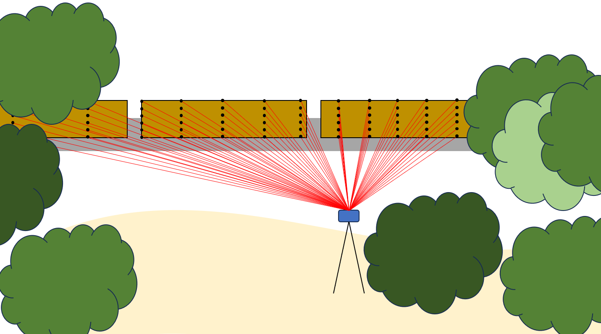

# Multimodal Roadside Vehicle Detection System

[](https://www.mdpi.com/1424-8220/25/2/370)
[](https://creativecommons.org/licenses/by/4.0/)
[](https://www.python.org/downloads/)
[](https://doi.org/10.3390/s25020370)

**Semantic Segmentation for Targeted Roadside Vehicle Detection Using Camera and LiDAR**

This repository contains the implementation of a portable, multimodal semantic segmentation system for roadside vehicle detection, as published in *Sensors* journal. The system uses both camera (RGB) and LiDAR sensors to identify and segment train cars and semi-trucks while ignoring other motor vehicles.



---

## Overview

This work presents a comprehensive multimodal approach to roadside vehicle detection and semantic segmentation. The system enables:

- **Targeted vehicle detection** for train cars and semi-trucks
- **Multimodal sensor comparison** between multiple 360° LiDAR and an RGB camera
- **Edge deployment** on embedded NVIDIA Jetson platforms for real-time inference
---

## Repository Structure

```
Multimodal-Roadside-Detection/
├── dl_camera/              # Camera-specific deep learning scripts
│   ├── Training script
│   ├── Inference pipelines
│   └── Model architecture
├── dl_lidar/              # LiDAR-specific deep learning scripts
│   ├── Point cloud processing
│   ├── Training scripts
│   └── PCD viewer
├── dl_utils/              # Shared utilities for data preparation
│   ├── h5 dataset management
│   ├── Naming + timestep tools
│   └── PCD helper scripts
├── Figures/               # Visualization and results figures
├── ResultLogs/            # Train/validation results and logs
├── Training Logs/         # Training history and metrics
├── HiResPCWeights.h5     # Pre-trained model weights
├── Dockerfile            # Container setup for deployment
├── setup.py              # Package installation
└── setup_repository.sh   # Repository setup script
```

---

## Getting Started

### Prerequisites

- Python 3.8+
- TensorFlow 2.x
- OpenCV Python
- Matplotlib
- h5py
- numpy
- pandas
- keras
- NVIDIA GPU (for training)
- NVIDIA Jetson platform (optional, for edge deployment)

### Installation

1. **Clone the repository**
   ```bash
   git clone https://github.com/UA-Roadside-Semantic-Segmentation/Multimodal-Roadside-Detection.git
   cd Multimodal-Roadside-Detection
   ```

2. **Run the setup script** (recommended)
   ```bash
   ./setup_repository.sh
   ```

   This installs all packages so they can communicate together.

3. **Docker deployment** (optional)
   ```bash
   docker build -t roadside-detection .
   docker run --gpus all -it roadside-detection
   ```

---

## Dataset

This project uses the **UA_L-DoTT (University of Alabama's Large Dataset of Trains and Trucks)** dataset.

### Dataset Specifications

- **Images**: ~93,000 RGB images from FLIR Blackfly S camera
- **Point Clouds**: ~350,000 scans from 5 different LiDAR sensors
- **Sensors Used**:
  - Velodyne Puck (VLP-16)
  - Velodyne Puck Hi-Res
  - Velodyne 32MR
  - Ouster OS-1
  - Ouster OS-2
- **Environments**: 4 unique locations with varying conditions
- **Conditions**: Day/night, clear/overcast, static/dynamic collection
- **Annotations**: ~9,000 labeled images, ~77,000 labeled point clouds

### Download Dataset

The complete UA_L-DoTT dataset is publicly available:

**Access**: [UA_L-DoTT on Figshare](https://plus.figshare.com/articles/dataset/UA_L-DoTT_University_of_Alabama_s_Large_Dataset_of_Trains_and_Trucks_-_Dataset_Repository/19311938/1)

**Citation**: 
```bibtex
@article{eastepp2022ua,
  title={UA\_L-DoTT: University of Alabama's large dataset of trains and trucks},
  author={Eastepp, Max and Faris, Lauren and Ricks, Kenneth},
  journal={Data in Brief},
  volume={42},
  pages={108073},
  year={2022},
  publisher={Elsevier}
}
```

---

## Model Architectures

### Camera Model (DeepLabV3+ with MobileNetV2)

- **Architecture**: DeepLabV3+ with MobileNetV2 backbone
- **Input**: RGB images (variable resolution)
- **Output**: Binary segmentation mask (vehicle/background)
- **Optimizer**: Adam
- **Loss Function**: Categorical Cross-Entropy
- **Transfer Learning**: Pre-trained on PASCAL-VOC dataset
- **Augmentations**: Gaussian noise, random flipping, random crops

### LiDAR Model (Custom CNN)

- **Architecture**: Custom CNN inspired by DeepLabV3+
- **Input**: Spherical projection of point clouds (XYZI channels)
- **Key Innovation**: Asymmetric downsampling to preserve spatial information
- **Resolution Handling**: Nearest-neighbor upsampling for unified model
- **Output**: Per-pixel classification (vehicle/background)
- **Optimizer**: Adam
- **Loss Function**: Categorical Cross-Entropy
- **Augmentations**: Random flipping, Gaussian noise (range and intensity)

### Spherical Projection

LiDAR point clouds are converted to image representation via spherical projection:
- Euclidean (XYZ) into spherical coordinates
- Spherical coordinates projected onto image plane
- Resolution: scanlines x horizontal points
- 4 channels: X, Y, Z, Intensity

---

## Performance Results

### Train Car Detection

| Model | Val mIOU | Test mIOU | Std Dev | FPS (PC) |
|-------|----------|-----------|---------|----------|
| **Camera** | 93.68% | 90.89% | 0.34% | 21.72 |
| **VLP-16** | 99.78% | 99.14% | 4.96% | 18.48 |
| **VLP-16 Hi-Res** | 99.92% | 99.30% | 4.49% | 18.64 |
| **32MR** | 99.85% | 99.41% | 3.34% | 18.24 |
| **OS-1** | 99.94% | 99.86% | 0.90% | 18.70 |
| **OS-2** | 99.36% | 98.27% | 6.19% | 17.08 |
| **All-LiDAR** | 99.79% | 99.15% | 5.07% | 17.02 |

### Semi-Truck Detection

| Model | Val mIOU | Test mIOU | Std Dev | FPS (PC) |
|-------|----------|-----------|---------|----------|
| **Camera** | 97.38% | 68.85% | 1.55% | 21.54 |
| **VLP-16** | 93.17% | 86.94% | 14.19% | 18.44 |
| **VLP-16 Hi-Res** | 98.52% | 92.56% | 15.52% | 18.41 |
| **32MR** | 98.15% | 96.02% | 9.76% | 18.29 |
| **OS-2** | 89.12% | 86.89% | 9.09% | 17.15 |
| **All-LiDAR** | 97.32% | 95.33% | 10.38% | 17.43 |

### Low-Light Performance

| Model | Test mIOU | Std Dev |
|-------|-----------|---------|
| **Camera (Low-Light)** | 34.23% | 1.04% |
| **32MR (Low-Light)** | 98.31% | 1.55% |

**Key Finding**: LiDAR maintains near-perfect accuracy in darkness while camera performance drops significantly.

---

## Edge Deployment

### Embedded Platform Results (Train Cars)

| Platform | Camera FPS | LiDAR FPS | Power | Notes |
|----------|-----------|-----------|-------|-------|
| **NVIDIA Xavier** | 6.24 | 7.09-7.64 | Higher | Real-time capable |
| **NVIDIA NX** | 7.74 | 8.59-9.59 | Medium | Real-time capable |
| **NVIDIA Nano** | 5.26 | CNR* | Lower | Memory limited |
| **Coral TPU** | CNR* | 0.49-2.12 | Lowest | Quantized only |

*CNR = Cannot Run due to hardware limitations

### Optimization Notes

- Models run without platform-specific optimizations
- TensorRT integration possible for improved performance
- Quantization to INT8 reduces accuracy (52-67% mIOU on TPU)
- Real-time performance achieved on Xavier and NX platforms

---

## Citation

If you use this code or dataset in your research, please cite our paper:

```bibtex
@article{ervin2025evaluation,
  title={Evaluation of Semantic Segmentation Performance for a Multimodal Roadside Vehicle Detection System on the Edge},
  author={Ervin, Lauren and Eastepp, Max and McVicker, Mason and Ricks, Kenneth},
  journal={Sensors},
  volume={25},
  number={2},
  pages={370},
  year={2025},
  publisher={MDPI},
  doi={10.3390/s25020370}
}
```

And the dataset paper:

```bibtex
@article{eastepp2022ua,
  title={UA\_L-DoTT: University of Alabama's large dataset of trains and trucks},
  author={Eastepp, Max and Faris, Lauren and Ricks, Kenneth},
  journal={Data in Brief},
  volume={42},
  pages={108073},
  year={2022},
  publisher={Elsevier},
  doi={10.1016/j.dib.2022.108073}
}
```

---

## License

This project is licensed under the CC BY License - see the [LICENSE](LICENSE) file for details.